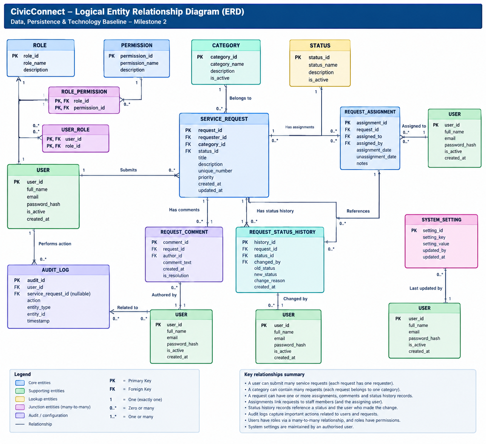

# Data and Persistence Baseline

> M2 §3 — Person 2 deliverable. Feeds into PED v2.0.
> Related: [persistence-decisions.md](persistence-decisions.md), [erd.png](erd.png), [../decisions/](../decisions/)

## 3.1 Relational persistence decision

**Baseline decision:** CivicConnect should use a relational SQL database for the MVP. The requirements contain strong relationships between users, requests, categories, statuses, assignments, comments and audit records, together with reporting and transactional consistency requirements. Referential integrity and ACID transactions therefore fit the domain directly.

A document-oriented NoSQL database is not selected for the M2 baseline because the stated requirements emphasise structured relationships, auditability, reporting and consistent multi-record updates.

## 3.2 Initial entities

| Entity | Purpose / relationships |
|---|---|
| User | Requester, staff, manager, administrator or support user; creates requests and performs actions. |
| Role / Permission | Supports RBAC; roles group permissions and users receive roles. |
| ServiceRequest | Core request; belongs to requester/category/status and has assignment, comment and history records. |
| Category | Predefined request category managed by authorised administrators. |
| Status | Controlled lifecycle value used by request workflow. |
| RequestAssignment | Records request-to-staff assignment and assignment history. |
| RequestComment | Stores comments/resolution information and author. |
| RequestStatusHistory | Chronological status-transition record with actor and timestamp. |
| AuditLog | Accountability/security record for important actions; ordinary users cannot delete it. |
| SystemSetting | Controlled administrative configuration. |

## 3.3 Logical ERD

<!-- Replace erd.png with the actual image committed alongside this file.
     If you use draw.io, commit the .drawio source too. -->

### Key relationships summary

- A user can submit many service requests (each request has one requester).
- A request belongs to one category; a category may relate to many requests.
- A request can have many comments and status-history records.
- Assignments link requests to staff members (and the assigning user).
- An audit-log entry references the responsible user and related request/entity.
- Audit logs capture important actions related to users and requests.
- Users have roles via a many-to-many relationship, and roles have permissions.
- System settings are maintained by an authorised user.

## 3.4 Initial relational schema

| Table | Representative fields | Integrity / index considerations |
|---|---|---|
| Users | UserId PK, Name, Email, IsActive, CreatedAt | Unique email; identity credentials handled by chosen auth mechanism. |
| Roles | RoleId PK, Name | Unique role name. |
| Permissions | PermissionId PK, Name | Unique permission. |
| UserRoles | UserId FK, RoleId FK | Composite uniqueness. |
| RolePermissions | RoleId FK, PermissionId FK | Composite uniqueness. |
| Categories | CategoryId PK, Name, IsActive | Unique name; inactive categories unavailable for new requests. |
| Statuses | StatusId PK, Name | Controlled values; unique name. |
| ServiceRequests | RequestId PK, RequestNumber, RequesterId FK, CategoryId FK, StatusId FK, Priority, CreatedAt, UpdatedAt, ResolvedAt | Unique RequestNumber; indexes for common filters/lookups. |
| RequestAssignments | AssignmentId PK, RequestId FK, StaffUserId FK, AssignedByUserId FK, AssignedAt, EndedAt | FK integrity; active-assignment index. |
| RequestComments | CommentId PK, RequestId FK, AuthorUserId FK, Body, CreatedAt | FK integrity; RequestId + CreatedAt index. |
| RequestStatusHistory | HistoryId PK, RequestId FK, FromStatusId FK, ToStatusId FK, ChangedByUserId FK, ChangedAt | FK integrity; RequestId + ChangedAt index. |
| AuditLogs | AuditId PK, ActorUserId FK, Action, EntityType, EntityId, Timestamp, Metadata | Append-oriented; restrict modification/deletion. |
| SystemSettings | SettingId PK, Key, Value, UpdatedByUserId FK, UpdatedAt | Unique key; administrator access only. |